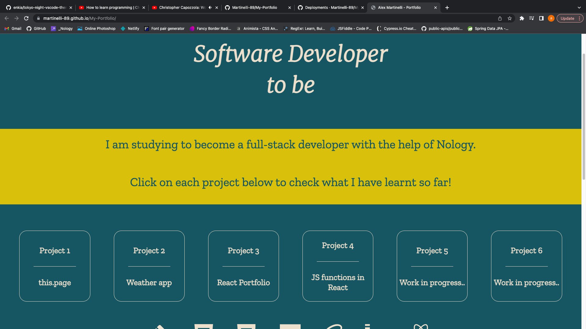

<h1>Portfolio </h1>

My first project on the nology course, building a portfolio in HTML to showcase the project I am going to build in the next few weeks.

<h2>Table of contents</h2>
<ul>
    <li>General Info</li>
    <li>Technologies</li>
    <li>Setup</li>
    <li>Status</li>
</ul>

<h2>General Info</h2>

This a basic HTML portfolio which was made on the first week of the nology consultancy programme.

<h2>Technologies</h2>

The website was built with:

<ul>
    <li>HTML</li>
    <li>CSS</li>
    <li>BEM</li>
</ul>

<h2>Setup</h2>

Access the site on  <a href="https://martinelli-89.github.io/My-Portfolio/">(link)</a>

<h2>Status</h2>

My knowledge vastely improved during the course and I have built a new portfolio in React, which you can visit here <a href="https://singular-macaron-770bc3.netlify.app/">(link)</a>
 
